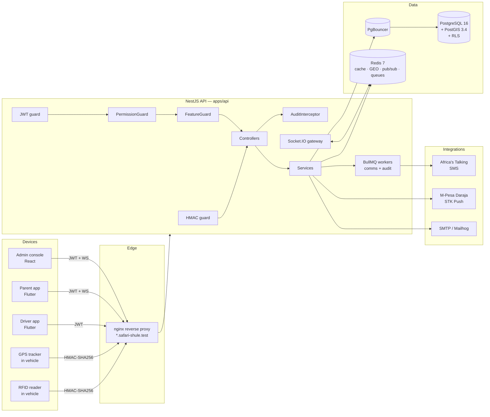

# Safari Shule

> Multi-tenant school transport platform for Kenya — live bus tracking, RFID boarding, SOS incidents, M-Pesa fee collection, and Africa's Talking SMS.

[](.nvmrc) [](package.json) [](apps/api/package.json) [](apps/api/prisma/schema.prisma) [](infra/docker-compose.yml) [](infra/docker-compose.yml) [](#license)

---

## Table of contents

1. [What this is](#1-what-this-is)
2. [Who it's for](#2-who-its-for)
3. [Product surface — the five modules](#3-product-surface--the-five-modules)
4. [Tech stack (exact versions)](#4-tech-stack-exact-versions)
5. [Repository layout](#5-repository-layout)
6. [Architecture at a glance](#6-architecture-at-a-glance)
7. [Multi-tenancy model (read this first)](#7-multi-tenancy-model-read-this-first)
8. [Prerequisites](#8-prerequisites)
9. [First-time setup](#9-first-time-setup)
10. [Everyday workflow](#10-everyday-workflow)
11. [Environment variables](#11-environment-variables)
12. [Local domains (Laravel Herd)](#12-local-domains-laravel-herd)
13. [Backend module map](#13-backend-module-map)
14. [Data model highlights](#14-data-model-highlights)
15. [Authentication & authorization](#15-authentication--authorization)
16. [Hardware ingestion (RFID + GPS)](#16-hardware-ingestion-rfid--gps)
17. [External integrations](#17-external-integrations)
18. [Observability](#18-observability)
19. [Testing](#19-testing)
20. [Common tasks (curl walkthrough)](#20-common-tasks-curl-walkthrough)
21. [Git & release workflow](#21-git--release-workflow)
22. [Hard rules for contributors](#22-hard-rules-for-contributors)
23. [Roadmap / what's not done yet](#23-roadmap--whats-not-done-yet)
24. [Troubleshooting](#24-troubleshooting)
25. [License](#25-license)

---

## 1. What this is

Safari Shule is a production-grade SaaS backend + admin console + mobile apps that a Kenyan school (or a group of schools) uses to run its transport operation end-to-end:

- Provision the school as a **tenant** (with its own subdomain and plan tier).
- Onboard **drivers, assistants, parents, caretakers, and students** with per-tenant **custom attribute schemas**.
- Register **vehicles**, track **fuel / repairs / insurance**, and pay for them via **M-Pesa STK Push**.
- Draw **routes and bus stops** (PostGIS geography), assign students, dispatch **trips**.
- Ingest **RFID boarding scans and GPS pings** from in-vehicle hardware over an HMAC-signed API.
- Broadcast **live bus positions** to parents and the ops console over WebSockets (Redis pub/sub).
- Handle **SOS incidents** with a single call: persist → broadcast → SMS parents.
- Send **SMS notifications** through Africa's Talking with per-plan quotas.

The system is designed to run many schools on **one database and one deployment**, with strict tenant isolation enforced at three layers (app, ORM, Postgres RLS).

## 2. Who it's for

| Persona | What they use |
|---|---|
| **School ops admin** | Web console — invite users, draw routes, monitor live buses, view incidents, reconcile M-Pesa |
| **Driver** | Mobile app — start shift, accept trip, mark boarding events, trigger SOS |
| **Assistant / Caretaker** | Mobile app — scan student RFID tags on boarding/alighting |
| **Parent** | Mobile app — see child's live bus, receive SMS/push notifications, pay fees |
| **Super-admin (platform)** | Provision new tenants, rotate hardware secrets, view all tenants |

## 3. Product surface — the five modules

1. **Custom Attribute Engine** — every tenant defines its own dynamic fields on `staff`, `student`, `parent`, `caretaker` (types: `string`, `number`, `phone`, `date`, `select`, `boolean`). Cached in Redis for 300s.
2. **Fleet / Routes / Financials** — `Vehicle`, `FuelLog`, `RepairLog`, `InsuranceRecord`, `Route`, `BusStop`, `Geofence`, `StudentRouteAssignment`. Fuel and repairs settle through **M-Pesa Daraja STK Push**.
3. **RFID Hardware Ingestion** — `RfidDevice` per vehicle, HMAC-SHA256 request signing, ±5-minute replay window, AES-256-GCM at rest for secrets.
4. **Trip Dispatch / Telemetry / Incidents** — `Trip`, `AttendanceEvent`, `GpsPing`, `Incident`, `IncidentEmergencyContact`. Live positions land in Redis GEO and stream out via **Socket.IO** with a Redis adapter.
5. **Dispatch Communicator** — templated SMS through **Africa's Talking**, quota-metered per plan tier, retried via **BullMQ**.

## 4. Tech stack (exact versions)

| Layer | Technology | Version |
|---|---|---|
| Runtime | Node.js | **20.11.0** (see `.nvmrc`) |
| Package manager | pnpm workspaces | **9.x** |
| Language | TypeScript (strict) | **5.5.4** |
| API framework | NestJS | **10.4.4** |
| ORM | Prisma | **5.20.0** |
| Database | PostgreSQL + PostGIS | **16 + 3.4** |
| Connection pooler | PgBouncer (tx mode) | **1.23.1** |
| Cache / queue / GEO / pub-sub | Redis | **7-alpine** |
| Queue library | BullMQ | **5.13.2** |
| Realtime | Socket.IO + Redis adapter | **4.7.5 / 8.3.0** |
| Validation | Zod (shared across apps) | **3.23.8** |
| Auth | Passport-JWT + argon2id | **4.0.1 / 0.41.1** |
| Metrics | prom-client + `@willsoto/nestjs-prometheus` | **15.1.3 / 6.0.1** |
| Error tracking | Sentry (GlitchTip locally) | **8.30.0** |
| Logging | Pino + `nestjs-pino` | **9.4.0 / 4.1.0** |
| SMS provider | Africa's Talking | **0.7.0** |
| Payments | M-Pesa Daraja (Axios client) | — |
| Web admin *(planned)* | Vite + React 18 + Tailwind + TanStack Query + Zustand + react-hook-form + react-leaflet | — |
| Mobile *(planned)* | Flutter + Riverpod + Dio + Hive (offline outbox) | — |
| Local mail | Mailhog | **v1.0.1** |
| Dashboards | Prometheus + Grafana | **v2.54.1 / 11.2.0** |
| Container base | `postgis/postgis:16-3.4`, `redis:7-alpine`, `nginx:1.27-alpine` | — |

## 5. Repository layout

```
safari-shule/
├── apps/
│   ├── api/                        NestJS backend (BUILT)
│   │   ├── src/
│   │   │   ├── app.module.ts
│   │   │   ├── main.ts
│   │   │   ├── auth/               argon2id + JWT (access 15m / refresh 7d + jti reuse-detection)
│   │   │   ├── audit/              AuditInterceptor → audit_log table
│   │   │   ├── comms/              Africa's Talking SMS + email + BullMQ processor
│   │   │   ├── common/
│   │   │   │   ├── context/        AsyncLocalStorage request context (tenantId, userId, bypass flag)
│   │   │   │   ├── crypto/         AES-256-GCM for hardware secrets, HMAC helpers
│   │   │   │   ├── errors/         Domain error hierarchy → HTTP mapper
│   │   │   │   ├── pagination/     Cursor + offset pagination
│   │   │   │   ├── prisma/         Prisma client + `.scoped` extension (auto-injects tenantId)
│   │   │   │   ├── realtime/       Socket.IO adapter wiring
│   │   │   │   ├── redis/          Global Nest provider (client, get/set/del/ping)
│   │   │   │   ├── tenant/         Tenant resolution middleware + `withTenantSession()` for RLS
│   │   │   │   └── validation/     Zod → Nest pipe bridge
│   │   │   ├── config/             `@nestjs/config` schemas
│   │   │   ├── feature-flags/      Per-PlanTier features + quotas (60s Redis cache)
│   │   │   ├── modules/
│   │   │   │   ├── attributes/     Custom attribute definitions + values
│   │   │   │   ├── fleet/          Vehicles, fuel, repairs, insurance
│   │   │   │   ├── hardware/       Device registration, HMAC guard, RFID + GPS ingest
│   │   │   │   ├── health/         `/v1/health` liveness + readiness
│   │   │   │   ├── incidents/      SOS pipeline (persist → broadcast → SMS)
│   │   │   │   ├── onboarding/     Invitations + acceptance
│   │   │   │   ├── payments/       M-Pesa Daraja STK Push + callback
│   │   │   │   ├── profiles/       staff, students, parents, caretakers, parent-student links
│   │   │   │   ├── routes/         Routes + bus stops (PostGIS GIST index) + student assignment
│   │   │   │   ├── telemetry/      Live GPS via Redis GEOADD + Socket.IO gateway
│   │   │   │   ├── tenant-admin/   Super-admin tenant provisioning
│   │   │   │   └── trips/          Dispatch, attendance events
│   │   │   ├── rbac/               Roles + permissions + guard (60s Redis cache)
│   │   │   └── types/              Ambient .d.ts (e.g. africastalking)
│   │   ├── prisma/
│   │   │   ├── schema.prisma       ~980 lines; all tables, enums, indexes
│   │   │   ├── migrations/         `0001_init/` baseline
│   │   │   └── seed.ts             Idempotent Hillcrest demo tenant
│   │   └── test/                   Jest e2e (5 suites, ~16 specs)
│   ├── web/                        Vite + React admin (PLANNED — Phase 7)
│   └── mobile/                     Flutter driver / parent / assistant (PLANNED — Phase 8)
├── packages/
│   └── shared-types/               Zod schemas + inferred TS types shared by api / web / (mobile bindings)
├── infra/
│   ├── docker-compose.yml          Full stack (postgres, pgbouncer, redis, mailhog, api, web, nginx, prometheus, grafana, glitchtip)
│   ├── Dockerfile.api              Multi-stage Node build
│   ├── Dockerfile.web              Multi-stage Vite build → nginx
│   ├── nginx.conf                  Subdomain-aware reverse proxy (api.*, tenant.*)
│   ├── postgres/init.sql           Enables postgis, pgcrypto, pg_trgm on first boot
│   ├── prometheus/prometheus.yml   Scrape targets
│   └── grafana/                    Provisioned datasource + dashboards
├── .copilot/SESSION-HANDOFF.md     What's built / broken / next (read on any new AI-assisted session)
├── .github/copilot-instructions.md Hard rules for AI coding agents
├── Makefile                        `make up`, `make db:migrate`, `make db:seed`, etc.
├── pnpm-workspace.yaml
├── tsconfig.base.json
├── .env.example                    Copy to `.env` for local dev
└── .nvmrc
```

## 6. Architecture at a glance



## 7. Multi-tenancy model (read this first)

Every tenant shares one database. Isolation is enforced at **three layers**:

1. **JWT claim (`tid`)** — the access token pins the tenant. An `x-tenant-id` header alone cannot escape.
2. **Prisma extension (`prisma.scoped`)** — every read automatically appends `where.tenantId`. Every `.create()` **must** pass `tenantId: requireTenantId()` explicitly (enforced by code review and typed helpers).
3. **PostgreSQL Row-Level Security** — long-running transactions run inside `withTenantSession()`, which issues `SET LOCAL app.tenant_id = ...`. Policies on every tenant-owned table use that GUC.

The only way to legitimately cross tenants is `runWithBypass()` (used by super-admin provisioning, seeding, and cross-tenant analytics). Every bypass is written to `audit_log`.

**Rule of thumb**: if you're writing a service that touches Prisma, either the request already has a `tenantId` in context (normal request), or you're deliberately calling `runWithBypass()` (rare — must be justified in the PR). There is no third case.

## 8. Prerequisites

Install once per workstation:

| Tool | Version | Install |
|---|---|---|
| Homebrew (macOS) | latest | https://brew.sh |
| Git | 2.40+ | `brew install git` |
| Node.js | **20.11.0** | `brew install nvm && nvm install` (auto-picks `.nvmrc`) |
| pnpm | 9.x | `corepack enable && corepack prepare pnpm@latest --activate` |
| Docker Desktop | 4.30+ | https://www.docker.com/products/docker-desktop |
| GitHub CLI | 2.55+ | `brew install gh` |
| Laravel Herd (optional, macOS) | latest | https://herd.laravel.com — only for `*.safari-shule.test` DNS + TLS |

Verify:

```bash
node --version      # v20.11.0
pnpm --version      # 9.x
docker --version    # 4.30+
docker compose version
```

## 9. First-time setup

```bash
# 1. Clone
git clone git@github.com:BonnieSpannah/safari-shule.git
cd safari-shule

# 2. Node
nvm use              # switches to 20.11.0
corepack enable

# 3. Dependencies
pnpm install

# 4. Environment
cp .env.example .env
# → open .env and set at minimum: JWT_ACCESS_SECRET, JWT_REFRESH_SECRET (32+ chars each)
#   Leave INTEGRATIONS_MODE=mock unless you have real AT / M-Pesa sandbox credentials.

# 5. Bring up stateful services (Postgres + Redis + Mailhog + Prometheus + Grafana + GlitchTip)
make up

# 6. Wait ~15s for Postgres to be healthy, then migrate + seed
make migrate
make seed
```

The seed prints the demo tenant credentials **and** a one-time RFID device `apiKey` + `hmacSecret` at the end — copy them into your password manager for curl / Postman.

### Demo credentials (after `make seed`)

| Role | Email | Password |
|---|---|---|
| System admin | `admin@hillcrest.ac.ke` | `Demo!Password1` |
| Driver A / B, Assistant, Parent, Caretaker | see seed output | `Demo!Password1` |

Tenant slug: `hillcrest` · Subdomain: `hillcrest.safari-shule.test`

## 10. Everyday workflow

The API runs **on the host** (not in Docker) for fast HMR; only stateful services live in compose.

```bash
# Terminal 1 — stateful services
make up

# Terminal 2 — API in watch mode
pnpm --filter @safari-shule/api run dev
# → http://localhost:3000/v1
# → Swagger UI at http://localhost:3000/docs (when enabled)

# Terminal 3 — shared-types watcher (optional; only if you're editing schemas)
pnpm --filter @safari-shule/shared-types run dev
```

Common one-shot commands:

```bash
pnpm --filter @safari-shule/api run build                   # nest build (must exit 0)
pnpm --filter @safari-shule/api exec tsc --noEmit           # typecheck only
pnpm --filter @safari-shule/api exec tsc --noEmit -p test/tsconfig.test.json  # typecheck tests
pnpm --filter @safari-shule/api run test                    # unit + integration
pnpm --filter @safari-shule/api run test:e2e                # e2e (requires make up + make migrate)
pnpm --filter @safari-shule/api exec prisma studio          # DB browser at localhost:5555
make db-shell                                               # psql into the container
make redis-shell                                            # redis-cli
make logs                                                   # tail all compose services
make reset                                                  # ⚠ DESTRUCTIVE — drops DB and re-seeds
```

## 11. Environment variables

Full template in [.env.example](.env.example). Grouped essentials:

| Group | Keys | Notes |
|---|---|---|
| Runtime | `NODE_ENV`, `API_PORT`, `WEB_PORT`, `APP_BASE_DOMAIN`, `INTEGRATIONS_MODE` | `INTEGRATIONS_MODE=mock` short-circuits AT + M-Pesa |
| Postgres | `POSTGRES_USER/PASSWORD/DB/HOST/PORT`, `DIRECT_URL`, `DATABASE_URL` | `DIRECT_URL` for Prisma migrate; `DATABASE_URL` goes through PgBouncer |
| Redis | `REDIS_HOST`, `REDIS_PORT`, `REDIS_URL` | |
| Auth | `JWT_ACCESS_SECRET`, `JWT_REFRESH_SECRET`, `JWT_ACCESS_TTL`, `JWT_REFRESH_TTL` | **Set 32+ char secrets before first run** |
| Africa's Talking | `AT_USERNAME`, `AT_API_KEY`, `AT_SENDER_ID`, `AT_DLR_CALLBACK_URL` | Sandbox works with `sandbox` username |
| M-Pesa Daraja | `MPESA_ENV`, `MPESA_CONSUMER_KEY`, `MPESA_CONSUMER_SECRET`, `MPESA_SHORTCODE`, `MPESA_PASSKEY`, `MPESA_CALLBACK_URL` | Only used when `INTEGRATIONS_MODE=live` |
| SMTP | `SMTP_HOST`, `SMTP_PORT`, `SMTP_USER`, `SMTP_PASSWORD`, `SMTP_FROM` | Points at Mailhog by default |
| Observability | `SENTRY_DSN_API`, `SENTRY_DSN_WEB`, `SENTRY_ENVIRONMENT`, `LOG_LEVEL` | Blank DSNs disable Sentry init |
| Hardware | `HARDWARE_HMAC_REPLAY_WINDOW_SECONDS`, `HARDWARE_THROTTLE_PER_MINUTE` | Defaults: 300s, 60 req/min |
| Crypto | `DATA_ENCRYPTION_KEY` | AES-256-GCM key for device `hmacSecret` at rest (32 bytes, hex-encoded) |

**Never commit `.env`.** The `.gitignore` already excludes it.

## 12. Local domains (Laravel Herd)

If you use Herd (macOS), park the project so `*.safari-shule.test` resolves over TLS:

```bash
ln -s ~/Projects/me/safari-shule ~/Herd/safari-shule
herd secure safari-shule
```

Target hostnames:

| Host | Points to |
|---|---|
| `safari-shule.test` | Web admin (Vite → 5173, once web exists) |
| `api.safari-shule.test` | Nest API (3000) |
| `hillcrest.safari-shule.test` | Tenant subdomain routing (via nginx `X-Tenant-Subdomain` header) |
| `mailhog.safari-shule.test` | Mailhog UI (8025) |
| `grafana.safari-shule.test` | Grafana (3001) |
| `prometheus.safari-shule.test` | Prometheus (9090) |
| `glitchtip.safari-shule.test` | GlitchTip (8001) |

Without Herd, use `http://localhost:<port>` directly.

## 13. Backend module map

All routes are prefixed with `/v1`.

| Module | Route root | Notable endpoints |
|---|---|---|
| **Auth** | `/v1/auth` | `POST /login`, `POST /refresh`, `POST /logout`, `GET /me` |
| **Onboarding** | `/v1/onboarding` | `POST /invitations`, `POST /invitations/:token/accept` |
| **Tenant admin** (super) | `/v1/tenant-admin` | `POST /tenants`, `GET /tenants`, `PATCH /tenants/:id` |
| **Attributes** | `/v1/attribute-definitions` | Full CRUD, target = `staff|student|parent|caretaker` |
| **Profiles** | `/v1/staff`, `/v1/students`, `/v1/parents`, `/v1/caretakers` | Full CRUD + `POST /parents/:id/students` for links |
| **Fleet** | `/v1/fleet` | Vehicles / fuel / repairs / insurance CRUD |
| **Routes** | `/v1/routes` | Route CRUD, bus stops (PostGIS), student assignments |
| **Trips** | `/v1/trips` | Dispatch, list, get, attendance events |
| **Telemetry** | `/v1/telemetry` | Push GPS, query last position; WS at `/ws/telemetry` |
| **Hardware** | `/v1/hardware` | `POST /gps`, `POST /rfid-scan`, `POST /devices` (admin), `POST /devices/:id/rotate` |
| **Incidents** | `/v1/incidents` | `POST /sos`, list, acknowledge, resolve |
| **Payments** | `/v1/payments/mpesa` | `POST /initiate`, `POST /callback` (public, IP-allowlisted) |
| **Health** | `/v1/health` | Liveness + Postgres + Redis readiness |

**Global request pipeline (in order)**: `ThrottlerGuard` → `JwtAuthGuard` → `PermissionGuard` → `FeatureGuard` → controller → `AuditInterceptor`.

## 14. Data model highlights

Full schema: [apps/api/prisma/schema.prisma](apps/api/prisma/schema.prisma) (~980 lines).

Core aggregates:

- **Tenancy / auth**: `Tenant`, `User`, `Role`, `Permission`, `RolePermission`, `UserRole`, `RefreshToken`, `OtpCode`, `Invitation`, `AuditLog`, `TenantFeature`
- **People**: `Staff`, `Student`, `Parent`, `Caretaker`, `ParentStudent`, `StudentCaretaker`, `AttributeDefinition`, `AttributeValue`
- **Fleet & finance**: `Vehicle`, `FuelLog`, `RepairLog`, `InsuranceRecord`, `MpesaTransaction`
- **Geo & routing**: `Route`, `BusStop`, `Geofence`, `RouteAssignment`, `StudentRouteAssignment` — geography columns are `Unsupported("geography(Point, 4326)")` and are written with raw SQL: `ST_SetSRID(ST_MakePoint(lng, lat), 4326)::geography`
- **Operations**: `Trip`, `AttendanceEvent`, `GpsPing`, `Incident`, `IncidentEmergencyContact`
- **Hardware**: `RfidDevice` (with encrypted `hmacSecret`)
- **Comms**: `NotificationTemplate`, `NotificationDispatch`

Indexes worth knowing about: GIST on `BusStop.location` and `Geofence.area`; composite `(tenantId, ...)` indexes on every high-traffic table; unique `(tenantId, slug)` / `(tenantId, subdomain)` invariants.

## 15. Authentication & authorization

- **Passwords**: `argon2id` via `hashPassword` / `verifyPassword` in `src/auth`.
- **Access token**: JWT, 15-minute TTL, payload `{ sub, tid, email, roles, permissions }`.
- **Refresh token**: JWT, 7-day TTL, includes `jti`. Reuse-detection: if a rotated `jti` is presented again, the whole family is revoked.
- **RBAC**: roles per tenant; permissions are strings like `vehicles.create`, `trips.dispatch`, `tenants.manage`. `@Permissions(...)` decorator + `PermissionGuard` — 60s Redis cache per user.
- **Feature flags**: `@Feature(...)` decorator + `FeatureGuard` — checks `TenantFeature` rows keyed by `PlanTier` (`basic` / `pro` / `enterprise`). Quotas (e.g. SMS/month) enforced at send-time.

Issuing tokens in code:

```ts
const { accessToken, refreshToken, accessTtlSeconds, refreshTtlSeconds, user } =
  await auth.issueTokenPair({ id, tenantId, email, fullName });
```

## 16. Hardware ingestion (RFID + GPS)

Every request to `/v1/hardware/*` (except device provisioning) MUST include:

| Header | Value |
|---|---|
| `X-Device-Id` | UUID returned when the device was registered |
| `X-Api-Key` | Public API key issued at registration |
| `X-Timestamp` | Current time in **milliseconds since epoch** |
| `X-Signature` | `HMAC-SHA256(hmacSecret, "${deviceId}.${timestamp}.${rawBody}")`, hex-encoded |

- **Replay window**: ±5 minutes (configurable via `HARDWARE_HMAC_REPLAY_WINDOW_SECONDS`).
- **Secret storage**: `RfidDevice.hmacSecret` is AES-256-GCM encrypted at rest with `DATA_ENCRYPTION_KEY`.
- **Rotation**: `POST /v1/hardware/devices/:id/rotate` — the old secret keeps working during a 24h grace window (`status = 'rotating'`).

Endpoints:

```
POST /v1/hardware/rfid-scan   { device_id, tag_uid, timestamp }
POST /v1/hardware/gps         { device_id, lat, lng, timestamp }
```

Reference implementation for signing (Node):

```ts
import { createHmac } from 'node:crypto';

const timestamp = Date.now();
const body = JSON.stringify({ device_id, tag_uid, timestamp });
const signature = createHmac('sha256', hmacSecret)
  .update(`${device_id}.${timestamp}.${body}`)
  .digest('hex');
```

## 17. External integrations

Set `INTEGRATIONS_MODE=mock` (default) to short-circuit everything below in dev/test. Never call live endpoints from a test suite.

- **Africa's Talking (SMS)** — `communications.service.ts` uses the official `africastalking` npm package. DLR webhook at `POST /v1/integrations/at/dlr`.
- **M-Pesa Daraja (STK Push)** — `payments/mpesa.service.ts`. Sandbox uses shortcode `174379` + Safaricom's public test passkey. Callback lands at `POST /v1/payments/mpesa/callback` (Public, IP allow-list in production).
- **SMTP / email** — `nodemailer` → Mailhog locally (`http://localhost:8025`).

## 18. Observability

Stack (all in `make up`):

| Service | URL | Purpose |
|---|---|---|
| **Prometheus** | http://localhost:9090 | Scrapes `/metrics` on API |
| **Grafana** | http://localhost:3001 (`admin` / `admin`) | Provisioned "API Overview" dashboard |
| **GlitchTip** | http://localhost:8001 | Sentry-compatible error tracking (self-hosted) |
| **Mailhog** | http://localhost:8025 | Outbound email inspection |
| **Bull Board** *(planned)* | `/admin/queues` | JWT + `tenants.manage` protected |

Custom Prometheus counters (planned Phase 9):

- `safari_outbound_messages_total{channel,status}`
- `safari_rfid_scans_total{result}`
- `safari_mpesa_transactions_total{purpose,status}`

Logs are structured JSON via Pino (`LOG_LEVEL=info` default; `debug` in local dev).

## 19. Testing

Test pyramid:

- **~60% unit** — `*.spec.ts` colocated with source; run with `pnpm --filter @safari-shule/api run test`.
- **~25% integration** — `*.int-spec.ts` (Prisma + real Postgres via compose).
- **~15% e2e** — `apps/api/test/*.e2e-spec.ts`, run with `pnpm --filter @safari-shule/api run test:e2e`.

Existing e2e suites (Phase 10):

| File | What it locks in |
|---|---|
| `cross-tenant-isolation.e2e-spec.ts` | Tenant A cannot read/write Tenant B's data through any path |
| `permissions.e2e-spec.ts` | RBAC blocks forbidden actions with 403 |
| `feature-gating.e2e-spec.ts` | Plan-tier features + quotas enforced |
| `hardware-hmac.e2e-spec.ts` | HMAC validity, timestamp skew, replay rejection |
| `sos.e2e-spec.ts` | SOS persist + broadcast + SMS legs |

Coverage gates (enforced in CI, Phase 9):
- Global patch coverage ≥ 80% on touched lines.
- ≥ 95% in `auth/`, `payments/`, `hardware/`.
- Weekly Stryker mutation testing on those three modules, threshold 70%.

## 20. Common tasks (curl walkthrough)

Full walkthrough will live in [docs/e2e-walkthrough.md](docs/e2e-walkthrough.md). Quickstart:

```bash
# 1. Log in as the seeded admin
TOKEN=$(curl -s -X POST http://localhost:3000/v1/auth/login \
  -H 'Content-Type: application/json' \
  -d '{"email":"admin@hillcrest.ac.ke","password":"Demo!Password1"}' \
  | jq -r '.accessToken')

# 2. List vehicles
curl -s http://localhost:3000/v1/fleet/vehicles \
  -H "Authorization: Bearer $TOKEN" | jq

# 3. Create a route
curl -s -X POST http://localhost:3000/v1/routes \
  -H "Authorization: Bearer $TOKEN" \
  -H 'Content-Type: application/json' \
  -d '{"name":"Route 3","code":"R3","direction":"morning_pickup"}' | jq

# 4. Simulate an RFID scan (requires seed-printed apiKey + hmacSecret)
DEVICE_ID=<from-seed>
API_KEY=<from-seed>
SECRET=<from-seed>
TS=$(node -e 'process.stdout.write(String(Date.now()))')
BODY='{"device_id":"'"$DEVICE_ID"'","tag_uid":"04A1B2C3","timestamp":'"$TS"'}'
SIG=$(node -e "console.log(require('crypto').createHmac('sha256','$SECRET').update('$DEVICE_ID.$TS.'+'$BODY').digest('hex'))")

curl -s -X POST http://localhost:3000/v1/hardware/rfid-scan \
  -H "X-Device-Id: $DEVICE_ID" \
  -H "X-Api-Key: $API_KEY" \
  -H "X-Timestamp: $TS" \
  -H "X-Signature: $SIG" \
  -H 'Content-Type: application/json' \
  -d "$BODY" | jq
```

## 21. Git & release workflow

We use **GitLab Flow** with environment branches on top of GitHub:

- `main` — trunk, always green, auto-deploys to `dev` (once CI is wired).
- `staging` — fast-forward-only from `main`, deploys to UAT.
- `production` — fast-forward-only from `staging`, tags SemVer, deploys prod.
- Feature branches: `feature/<TICKET>-<kebab>`, short-lived, squash-merge into `main`.

Commit format: **Conventional Commits** (`feat`, `fix`, `chore`, `docs`, `refactor`, `perf`, `test`, `build`, `ci`). Breaking = `feat(api)!: …`.

Container strategy: **build once per merged commit, promote the digest** through dev → staging → production. All stateful services always run in Docker.

Full workflow detail: [.copilot/SESSION-HANDOFF.md](.copilot/SESSION-HANDOFF.md) and the internal architecture doc.

## 22. Hard rules for contributors

Non-negotiable (see [.github/copilot-instructions.md](.github/copilot-instructions.md)):

1. Every `prisma.*.create()` passes explicit `tenantId: requireTenantId()`. Reads go through `prisma.scoped`. Cross-tenant work uses `runWithBypass()` and is audited.
2. `SET LOCAL app.tenant_id` inside long transactions via `withTenantSession()`.
3. JWT `tid` claim is authoritative; `x-tenant-id` header alone cannot unlock another tenant.
4. Hardware HMAC scheme (see §16) — never weaken the timestamp window or accept unsigned bodies.
5. `INTEGRATIONS_MODE=mock` in dev/test; never hit live AT / M-Pesa from a test.
6. No file-header docstrings. No `// TODO`. No "added for X" comments. Comment only when the **why** is non-obvious.
7. Passwords: argon2id. Tokens: 15m access + 7d refresh with `jti` reuse-detection.
8. Production-grade code only — no stubs, no placeholder handlers.

## 23. Roadmap / what's not done yet

- ⬜ Run the e2e suite end-to-end against real Postgres+Redis (`make up && make migrate && pnpm --filter @safari-shule/api run test:e2e`).
- ⬜ **Phase 7 — Web admin** (`apps/web`): Vite + React + Tailwind + TanStack Query + Zustand + react-leaflet.
- ⬜ **Phase 8 — Flutter mobile** (`apps/mobile`): Driver / Parent / Assistant shells with Riverpod + Dio + Hive offline outbox.
- ⬜ **Phase 9 — Observability**: Bull Board at `/admin/queues`, Prometheus counters listed in §18.
- ⬜ **CI/CD workflows** in `.github/workflows/` (ci, build-image, deploy-dev, preview-pr, promote-staging, promote-production, release-please, rollback, db-migration-check, mutation-weekly, codeql, dependency-review, project-automation).
- ⬜ **Docs**: 22 planned deliverables under `/docs` (install guide, user guides per role, architecture, threat model, runbook, release, contributing, troubleshooting, compliance).
- ⬜ **Herd wiring** for `*.safari-shule.test` with mkcert-signed TLS.
- ⬜ **Branch protection** on `main` / `staging` / `production` (signed commits, linear history, required checks, CODEOWNERS on `auth/**`, `payments/**`, `hardware/**`, `prisma/**`).

Detailed status: [.copilot/SESSION-HANDOFF.md](.copilot/SESSION-HANDOFF.md).

## 24. Troubleshooting

| Symptom | Fix |
|---|---|
| `pnpm install` fails on `argon2` | Install Xcode CLT (`xcode-select --install`); on Linux, `apt install build-essential` |
| `make up` errors on port 5432 / 6379 | Another Postgres/Redis is bound — `lsof -i :5432` and stop it, or change `POSTGRES_PORT` / `REDIS_PORT` in `.env` |
| Prisma "database schema is not in sync" | `pnpm --filter @safari-shule/api exec prisma migrate deploy` (or `make migrate`) |
| HMAC always 401 | Check clock drift on the client (macOS: `sntp -sS time.apple.com`); confirm you're using **milliseconds**, not seconds |
| WebSocket won't connect | The Socket.IO adapter needs Redis — verify `make ps` shows `safari-redis` healthy |
| e2e tests time out | Confirm `INTEGRATIONS_MODE=mock` in `.env`; some suites won't finish waiting for AT/M-Pesa if live mode is set |
| "Cannot find module `@safari-shule/shared-types`" | `pnpm install` at the repo root — workspace symlinks aren't hoisted otherwise |

More: [docs/support/troubleshooting.md](docs/support/troubleshooting.md) *(planned)*.

## 25. License

Proprietary. All rights reserved © Safari Shule contributors. Not for redistribution.
