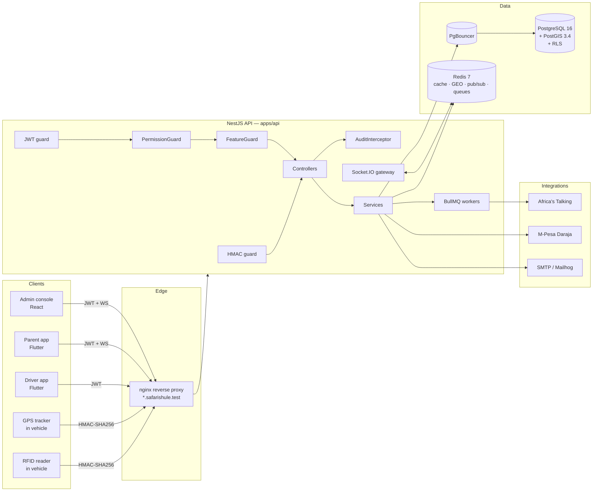
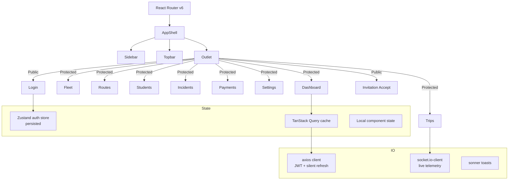

# Architecture — Safari Shule

## Bird's-eye view

## Request lifecycle

1. **nginx** terminates TLS and routes by subdomain (`api.*` → api:3000, tenant `*.safarishule.test` → web:5173 with `X-Tenant-Subdomain` injected).
2. **ThrottlerGuard** — global rate limit + per-route overrides.
3. **JwtAuthGuard** *(skipped for `@Public()` and hardware routes)* — verifies signature, extracts `tid`, `sub`, `roles`, `permissions`.
4. **PermissionGuard** — declaratively enforced via `@Permissions('vehicles.create', …)`. 60-second Redis cache per user.
5. **FeatureGuard** — declaratively enforced via `@Feature('sms.outbound')`. Checks `TenantFeature` for the caller's `PlanTier` and quotas.
6. **Controller** delegates to a service.
7. **Service** uses `prisma.scoped` (auto-injects `tenantId`) or `withTenantSession()` for transactions requiring RLS.
8. **AuditInterceptor** writes a row to `audit_log` including `traceId`, `tenantId`, `userId`, method, path, status, latency.
9. Response returned; Pino emits a structured JSON log with the same `traceId`.

## Modules

Full module inventory: [../README.md#whats-inside](../README.md).

| Module | Path | Key responsibility |
|---|---|---|
| Auth | `apps/api/src/auth` | argon2id + JWT access/refresh + `jti` reuse-detection |
| RBAC | `apps/api/src/rbac` | Roles, permissions, cached guard |
| Feature flags | `apps/api/src/feature-flags` | Per-plan features + quota metering |
| Tenancy | `apps/api/src/common/tenant`, `context` | Middleware, ALS, `runWithBypass()`, `withTenantSession()` |
| Prisma extension | `apps/api/src/common/prisma` | `.scoped` auto-injects `tenantId` on reads |
| Audit | `apps/api/src/audit` | Interceptor + `audit_log` writer |
| Comms | `apps/api/src/comms` | Africa's Talking, SMTP, BullMQ processor |
| Payments | `apps/api/src/modules/payments` | M-Pesa Daraja STK Push + callback |
| Hardware | `apps/api/src/modules/hardware` | Device registration, HMAC guard, RFID + GPS ingest |
| Fleet | `apps/api/src/modules/fleet` | Vehicles, fuel, repairs, insurance |
| Routes | `apps/api/src/modules/routes` | Routes, bus stops, geofences (PostGIS) |
| Trips | `apps/api/src/modules/trips` | Dispatch, attendance |
| Telemetry | `apps/api/src/modules/telemetry` | Redis GEO + Socket.IO gateway |
| Incidents | `apps/api/src/modules/incidents` | SOS pipeline |
| Onboarding | `apps/api/src/modules/onboarding` | Invitations |
| Tenant admin | `apps/api/src/modules/tenant-admin` | Super-admin tenant provisioning |
| Profiles | `apps/api/src/modules/profiles` | Staff, students, parents, caretakers, links |
| Attributes | `apps/api/src/modules/attributes` | Per-tenant custom fields |
| Health | `apps/api/src/modules/health` | Liveness + Postgres + Redis readiness |

## Web application (apps/web)

- **Server state** → TanStack Query. Everything server-owned is a hook (`useVehicles`, `useLiveTrip`, …).
- **Session** → Zustand persisted store. Access token in memory + `localStorage`, refresh token as httpOnly `Set-Cookie` from API.
- **Silent refresh** — axios interceptor detects 401, queues concurrent requests behind a single refresh promise, retries.
- **Realtime** — one shared `Socket` connection joined to tenant + trip rooms.

## Data model

Full schema: [apps/api/prisma/schema.prisma](../apps/api/prisma/schema.prisma) (~980 lines).

Aggregates:

- **Tenancy / auth** — `Tenant`, `User`, `Role`, `Permission`, `RolePermission`, `UserRole`, `RefreshToken`, `OtpCode`, `Invitation`, `AuditLog`, `TenantFeature`
- **People** — `Staff`, `Student`, `Parent`, `Caretaker`, `ParentStudent`, `StudentCaretaker`, `AttributeDefinition`, `AttributeValue`
- **Fleet & finance** — `Vehicle`, `FuelLog`, `RepairLog`, `InsuranceRecord`, `MpesaTransaction`
- **Geo & routing** — `Route`, `BusStop`, `Geofence`, `RouteAssignment`, `StudentRouteAssignment` (geography columns are `Unsupported("geography(Point, 4326)")`)
- **Operations** — `Trip`, `AttendanceEvent`, `GpsPing`, `Incident`, `IncidentEmergencyContact`
- **Hardware** — `RfidDevice`
- **Comms** — `NotificationTemplate`, `NotificationDispatch`

Indexes: GIST on `BusStop.location` and `Geofence.area`; composite `(tenantId, …)` on high-traffic tables; unique `(tenantId, slug)` / `(tenantId, subdomain)`.

## Multi-tenancy — three layers

1. **JWT `tid` claim** is authoritative. An `x-tenant-id` header alone cannot escape.
2. **Prisma `.scoped`** extension appends `where.tenantId` to every read. `.create()` must pass `tenantId: requireTenantId()` explicitly.
3. **Postgres RLS** — long transactions wrap `withTenantSession()` which issues `SET LOCAL app.tenant_id = ...`. Policies on every tenant-owned table use that GUC.

The only legal cross-tenant path is `runWithBypass()` — used by super-admin provisioning and seeding — and every use is audited.

## Realtime

- **Server** — Socket.IO with Redis adapter for horizontal scale. Namespaces: `/telemetry`, `/incidents`.
- **Rooms** — one per `tenantId:trip:<id>` (trip subscribers) and one per `tenantId:incidents` (ops console).
- **Auth** — WS handshake includes JWT in the `Authorization` extraheader; connection rejected on invalid token.

## Queues (BullMQ on Redis)

| Queue | Producer | Consumer | Purpose |
|---|---|---|---|
| `comms.sms` | `CommunicationsService` | `CommsProcessor` | Fan-out to Africa's Talking |
| `comms.email` | `CommunicationsService` | `CommsProcessor` | Fan-out to nodemailer |
| `audit.persist` | `AuditInterceptor` | `AuditProcessor` | Batched writes to `audit_log` |
| `hardware.ingest` | `HardwareController` | `HardwareIngestProcessor` | Debounces + validates RFID/GPS bursts |

Retry: exponential 1s → 60s, 5 attempts, DLQ after final failure.

Dashboard *(planned M3)*: Bull Board at `/admin/queues` gated by `tenants.manage`.

## Observability

Every request carries a `traceId` (generated by nginx or the API if absent) — propagated to logs, audit rows, and outbound HTTP.

- **Logs** — Pino JSON to stdout; Docker collects.
- **Metrics** — `/metrics` scraped by Prometheus. Counters (planned M3):
  - `safari_outbound_messages_total{channel,status}`
  - `safari_rfid_scans_total{result}`
  - `safari_mpesa_transactions_total{purpose,status}`
- **Errors** — Sentry / GlitchTip via DSN.
- **Dashboards** — Grafana provisions API Overview at http://localhost:3001.

## Security summary

Full detail: [SECURITY.md](SECURITY.md).

- Passwords: argon2id.
- Access JWT 15m; refresh 7d with `jti` reuse-detection.
- Hardware: HMAC-SHA256 (`${deviceId}.${ts_ms}.${rawBody}`), ±5m replay window, AES-256-GCM secrets at rest.
- CORS: strict allowlist from `APP_BASE_DOMAIN`.
- SQL injection: Prisma parameterization + RLS.
- Rate limits: Throttler global + tighter on `/auth/*`, `/hardware/*`, `/payments/mpesa/callback`.
